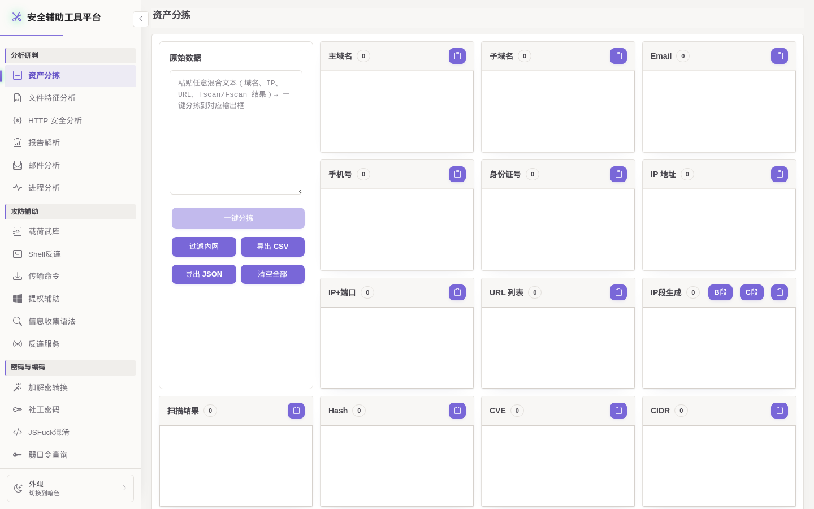
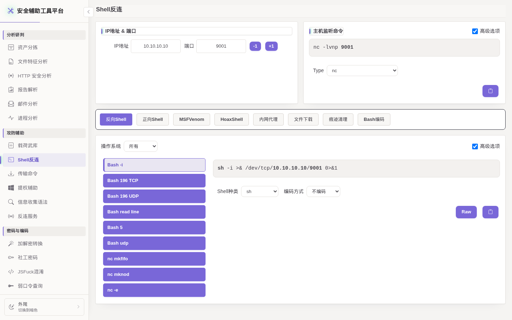
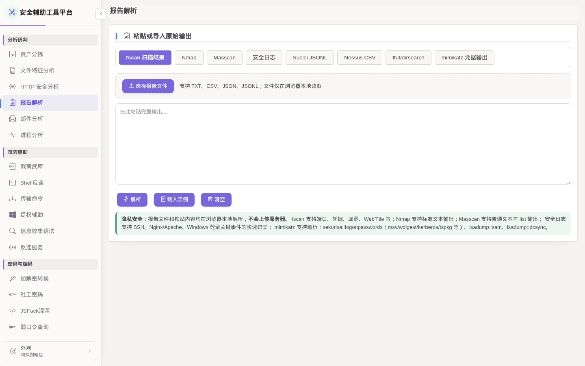

# SecBox-Web

SecBox-Web 是一套面向授权安全测试、应急响应、安全分析、CTF 与日常运维排查的 Web 工具箱，也是 [Test-tools](https://github.com/Acczdy/Test-tools) 的重新设计与持续维护版本。项目将常用安全能力集中在统一界面中，并提供亮色/暗色主题、分类导航、报告解析与 Docker 部署支持。

> [!WARNING]
> 本项目仅限用于已获得明确授权的安全测试、个人实验环境、合法竞赛及防御分析。严禁用于未授权访问、破坏系统、窃取数据或其他违法行为。使用者应自行确认授权范围，并承担部署和使用本项目产生的责任。



## 功能概览

- 资产与情报：资产分拣、个人信息识别、Google/Bing/百度信息收集语法
- 扫描报告：fscan（含 ICMP 存活主机）、Nmap、Masscan、Nuclei、Nessus、ffuf、dirsearch、安全日志与 mimikatz 解析，提供优先处置队列、资产风险排行、攻击面/漏洞/凭据聚合，并支持 TXT、Excel、Markdown、PDF 导出
- 分析工具：文件特征分析、HTTP 请求/响应分析、Windows 进程识别、提权辅助
- 编码与令牌：加解密转换、JSFuck、JWT 生成、解析与安全测试
- 辅助生成：Shell 反连、文件传输命令、FRP 配置、社工字典
- 安全资料：载荷武库、默认密码查询、Windows 提权 EXP 索引
- OOB 回调：RMI、LDAP、HTTP 回调，支持后端密码校验、登录失败限流和 7 天签名 Cookie
- AI 研判（可选）：围绕邮件和扫描报告进行深度分析与连续对话

| Shell 反连 | 报告解析 |
|---|---|
|  |  |

## Docker 部署（推荐）

环境要求：Docker Engine 与 Docker Compose v2。

### 1. 获取项目

```bash
git clone https://github.com/Acczdy/SecBox-Web.git
cd SecBox-Web
```

### 2. 设置环境参数

复制配置模板：

```bash
cp .env.example .env
```

编辑项目根目录的 `.env`，为三种 OOB 服务分别设置一个 TCP 高位端口：

```dotenv
OOB_RMI_PORT=<RMI 回调端口>
OOB_LDAP_PORT=<LDAP 回调端口>
OOB_HTTP_CALLBACK_PORT=<HTTP 回调端口>
```

端口要求：

- 取值范围为 `1024-65535`
- 三个端口必须互不相同
- 不得与 Web 服务端口 `5001` 重复
- 服务器安全组和防火墙需要放行对应的 TCP 端口

项目不提供默认 OOB 端口。配置缺失、格式错误、超出范围或发生冲突时，服务会拒绝启动并显示具体原因。

### 3. 构建并启动

```bash
docker compose up -d --build
docker compose logs security-tools
```

首次启动时，日志会显示随机生成的 OOB 访问密码：

```text
[首次启动] OOB 反连服务访问密码: <随机密码>
```

请及时保存该密码。运行时状态保存 Flask 签名密钥和 OOB 密码的 PBKDF2 哈希，不保存密码明文。

启动完成后访问：

```text
http://服务器地址:5001
```

公网部署建议通过 HTTPS 反向代理或 WAF 提供 Web 访问，并限制管理页面的允许来源。

## OOB 密码管理

交互式重置密码（推荐）：

```bash
docker compose exec security-tools python manage.py reset-oob-password
```

通过命令参数设置密码（至少 12 位）：

```bash
docker compose exec security-tools python manage.py reset-oob-password \
  --password 'Your-New-Strong-Password'
```

生成新的随机密码：

```bash
docker compose exec security-tools python manage.py generate-oob-password
```

密码重置后，已有 OOB 登录 Cookie 会立即失效。

## 邮件与报告 AI 分析（可选）

邮件分析和报告解析支持可选的 AI 深度研判与连续对话。基础解析与本地导出不依赖 AI；只有用户输入访问密码并主动点击“开始 AI 分析”后，服务端才会向部署者配置的模型服务发起请求。

如需启用，请在项目根目录的本地 `.env` 文件中填写以下配置。示例不预置任何服务地址、密钥或模型值：

```dotenv
AI_API_URL=
AI_API_KEY=
AI_MODEL=
```

- `AI_API_URL`：填写兼容 Chat Completions 协议的完整接口地址
- `AI_API_KEY`：填写模型服务提供方签发的服务端访问凭据
- `AI_MODEL`：填写该服务实际支持的模型标识

三项均配置后 AI 功能才会启用。

AI 功能与 OOB 共用首次启动生成的访问密码，密码重置后已有 AI 登录 Cookie 同步失效。无需配置独立的 AI 登录密码。

发送范围与数据处理：

- 邮件仅发送精简的结构化分析结果及必要正文；不发送附件二进制、原始邮件和 HTML 正文
- 扫描报告的大列表最多发送前 500 条，聚合分析每组最多发送前 300 条
- 对话与结构化分析上下文保存在运行时目录的 SQLite 数据库中，默认保留 24 小时
- AI 输出属于辅助研判结果，应结合原始证据进行人工复核

## 部署参数

| 变量 | 默认值 | 说明 |
|---|---:|---|
| `OOB_RMI_PORT` | 必填 | RMI 回调 TCP 端口 |
| `OOB_LDAP_PORT` | 必填 | LDAP 回调 TCP 端口 |
| `OOB_HTTP_CALLBACK_PORT` | 必填 | HTTP 回调 TCP 端口 |
| `OOB_HOST` | 自动探测 | RMI/LDAP 回调使用的公网 IP 或域名 |
| `OOB_HTTP_HOST` | 同 `OOB_HOST` | 页面生成 HTTP 地址时使用的主机 |
| `OOB_HTTP_CALLBACK_HOST` | 同 `OOB_HOST` | HTTP 直连回调使用的主机 |
| `OOB_COOKIE_SECURE` | `1` | 在 HTTPS 环境中签发 Secure Cookie |
| `TRUST_PROXY_HEADERS` | `0` | 可信反向代理环境下按需启用 |
| `OOB_SESSION_TTL_HOURS` | `24` | OOB 用户凭证有效期（小时） |
| `OOB_MAX_CONNS` | `200` | RMI/LDAP 并发连接上限 |
| `AI_API_URL` | 未设置 | 模型服务的 Chat Completions 接口地址 |
| `AI_API_KEY` | 未设置 | 模型服务的服务端访问凭据 |
| `AI_MODEL` | 未设置 | 模型服务支持的模型标识 |

如需指定回调域名，可在启动时设置：

```bash
OOB_HOST=oob.example.com docker compose up -d
```

## 常用运维命令

```bash
# 查看服务状态
docker compose ps

# 查看运行日志
docker compose logs -f security-tools

# 重启服务
docker compose restart security-tools

# 更新并重新构建
git pull
docker compose up -d --build

# 停止服务
docker compose down
```

运行状态保存在 Docker 卷 `runtime-data` 中。执行 `docker compose down` 会保留该卷；删除该卷会使签名密钥、OOB 密码及相关运行状态重新生成。

## 本地运行

```bash
python -m venv .venv
source .venv/bin/activate
pip install -r requirements.txt

export OOB_RMI_PORT=<RMI 回调端口>
export OOB_LDAP_PORT=<LDAP 回调端口>
export OOB_HTTP_CALLBACK_PORT=<HTTP 回调端口>

python app.py
```

Windows PowerShell 可使用：

```powershell
$env:OOB_RMI_PORT = "<RMI 回调端口>"
$env:OOB_LDAP_PORT = "<LDAP 回调端口>"
$env:OOB_HTTP_CALLBACK_PORT = "<HTTP 回调端口>"
python app.py
```

本地运行状态位于 `runtime/secrets.json`。可使用 `python manage.py reset-oob-password` 设置 OOB 访问密码。

## 测试

```bash
python -m unittest discover -s tests -q
for test_file in tests/*.js; do node "$test_file"; done
```

## 公网部署建议

- 使用 HTTPS，并在可信反向代理或 WAF 后提供 Web 页面
- 使用防火墙限制 Web 管理端口的访问来源
- 仅在需要接收回调时开放三个 OOB TCP 端口
- 保持单个 Gunicorn worker；OOB 凭证和回调记录当前存储在进程内存中
- 定期更新系统、Docker、Python 依赖和项目版本
- 保留 OOB 后端鉴权、登录失败限流及安全 Cookie 设置
- 启用 AI 前确认模型服务的数据处理政策，避免发送超出授权范围的报告或邮件内容

安全问题报告方式见 [SECURITY.md](SECURITY.md)。

## 项目来源与许可证

SecBox-Web 在多个公开安全工具、网页工具和公开资料的基础上进行了整合与二次开发。主要来源、功能映射与许可证说明见 [THIRD_PARTY_NOTICES.md](THIRD_PARTY_NOTICES.md)。感谢相关项目作者和社区贡献者。

本项目作者有权许可的新增与修改代码采用 [MIT License](LICENSE)。第三方代码、数据、图标、字体和其他素材继续遵循其各自的许可证或权利声明。若发现来源、署名或许可信息存在遗漏，欢迎提交 Issue 协助更正。

## 免责声明

本软件按“原样”提供，不承诺适销性、特定用途适用性或不存在缺陷。作者及贡献者不对使用或误用本项目造成的攻击流量、服务暴露、数据损失、业务中断及其他直接或间接损害承担责任。下载、部署或使用本项目，即表示使用者理解并同意仅在合法授权范围内操作。

## 贡献

提交代码前请阅读 [CONTRIBUTING.md](CONTRIBUTING.md)。安全漏洞请按照 [SECURITY.md](SECURITY.md) 中的方式报告，避免在公开 Issue 中披露可直接利用的细节。
